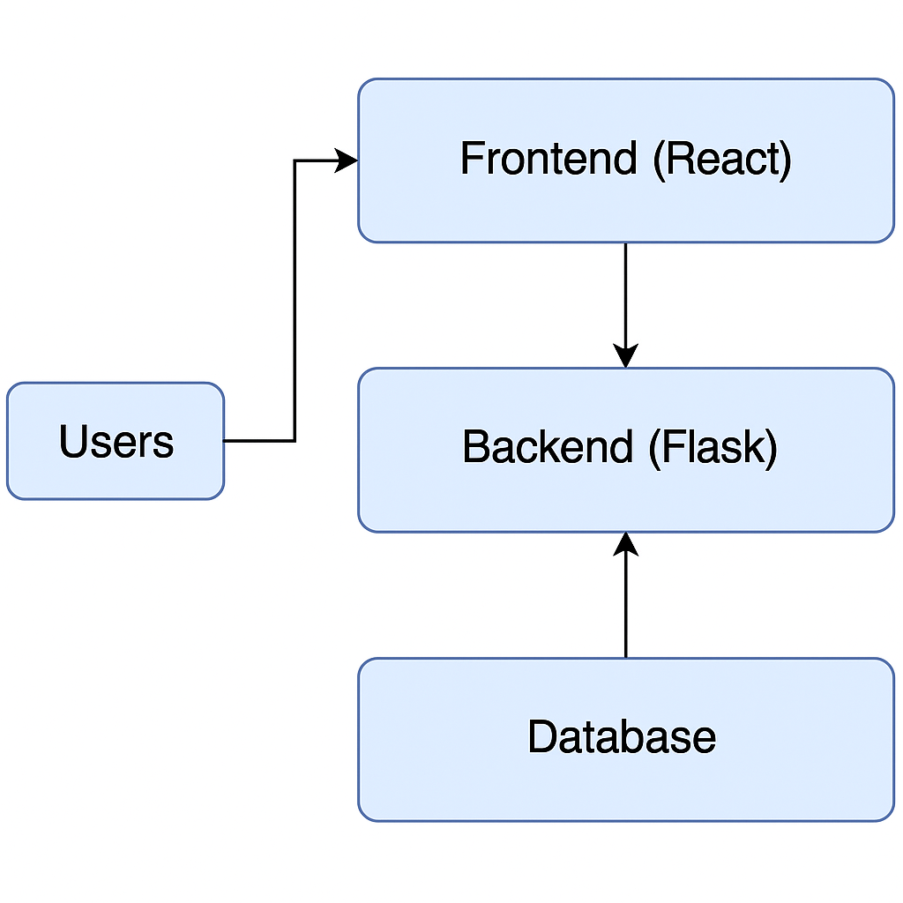
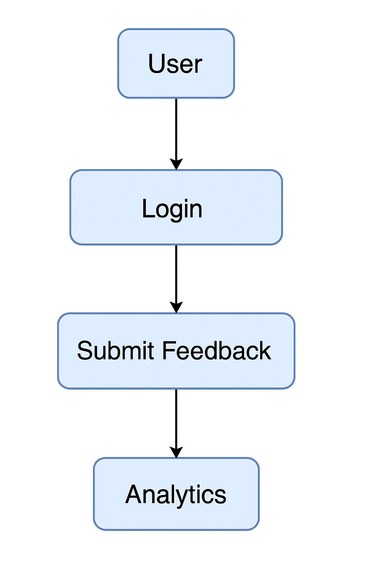

# 📝 Feedback Collection System


---

## 🚀 Overview
The **Feedback Collection System** is a full-stack, scalable platform designed for real-time feedback management.  
It offers:
- 🖼 Customizable forms with version control
- 🔒 Secure user authentication & encrypted storage
- 📊 Visual analytics dashboards for admins
- 📬 Automated notifications & multi-channel accessibility
- 📤 Export options & integration with external platforms
- ⚙️ Moderation tools to maintain content quality

> ⚡ *Built for cross-device responsiveness and seamless UX.*

---

## 🛠 Tech Stack
- Frontend: React.js + Tailwind CSS
- Backend: Python (Flask)
- Database: PostgreSQL / MongoDB
- APIs: REST / GraphQL
- Deployment: Docker, Heroku / AWS

---

## 📦 Features
✅ Real-time feedback submission  
✅ Visual analytics & insights  
✅ User & admin dashboards  
✅ Secure login & JWT auth  
✅ Customizable form builder  
✅ Feedback history tracking  
✅ Integration & export tools

---

## 🏗 Architecture


---

## 🔄 User Flow


---


## 🚀 Getting Started
```bash
# Clone the repository
git clone https://github.com/SangeethaSharvani/feedback-collection-system.git

# Backend setup
cd backend
pip install -r requirements.txt

# Frontend setup
cd ../frontend
npm install
npm start
```

---

## 🧪 Tests
```bash
cd backend
pytest

# or frontend tests
npm test
```

---

## 🗺 Roadmap
- [ ] Add sentiment analysis for feedback
- [ ] Mobile app version
- [ ] Admin role management
- [ ] Slack / Teams integration

---

## 🤝 Contributing
Contributions, issues, and feature requests are welcome!


---

## ✨ Author
- Sangeetha ([@SangeethaSharvani](https://github.com/SangeethaSharvani))
